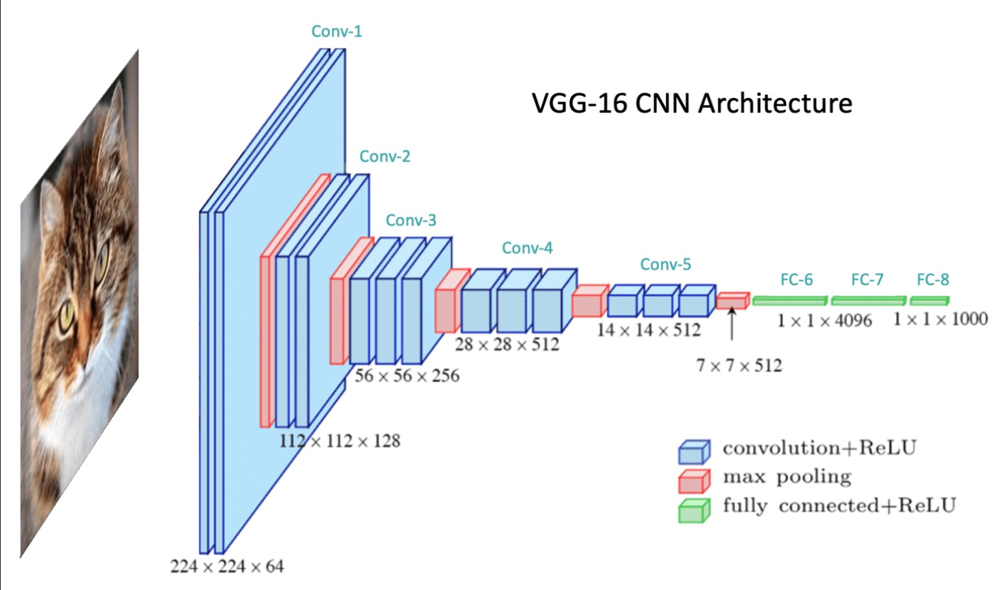

# Réseau de Neurones From Scratch – Iris Dataset

Ce projet implémente un réseau de neurones profond (DNN) en Python avec `numpy`, pour classer les fleurs du dataset Iris (3 classes).

## Contenu

- `data.py` : chargement et préparation des données
- `utils.py` : fonctions d’activation, softmax, pertes
- `model.py` : forward, backward, entraînement, prédiction
- `main.py` : script principal d'entraînement/test

## Modèle 

### CNN


Un CNN, ou réseau de neurones convolutifs, est un type d’intelligence artificielle qu’on utilise pour reconnaître des images. Par exemple, il peut aider un ordinateur à dire si une photo montre un chat, un chien ou une voiture.

Un CNN agit comme une loupe permettent à mon réseaux de regarder une image pixel par pixel :

Convolution :
Il utilise des "filtres" (comme des petites fenêtres) pour scanner l’image et repérer des formes simples, comme des lignes ou des coins.

ReLU (activation) :
Il garde seulement les infos utiles (comme si on faisait le tri dans ce qu’il a vu).

Pooling :
Il réduit la taille de l’image pour garder l’essentiel, un peu comme faire un résumé d’un texte.

Répétition :
Il recommence plusieurs fois ce processus, en repérant à chaque fois des choses plus compliquées (par exemple, après les lignes → un œil → un visage).

Décision finale :
À la fin, un autre réseau (qu’on appelle souvent un "classifieur") décide ce que l’image montre : un chat, un chien, etc.

## Exécution

```bash
python main.py

